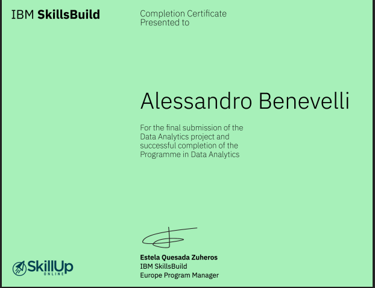

# Airbnb New York City - Exploratory Data Analysis

**Final Capstone Project** | IBM Data Analysis Professional Certificate

---

## 📋 Project Overview

This project presents a complete **Exploratory Data Analysis (EDA)** of the Airbnb market in New York City. Starting from a raw dataset, the analysis includes data cleaning, preprocessing, visualization, and the extraction of meaningful business insights regarding pricing patterns, room types, and neighbourhood performance.

---

## 🎯 Objectives

- Assess data quality and perform thorough cleaning (missing values, duplicates, inconsistencies)
- Standardize column names and data formats
- Analyze pricing dynamics across room types and boroughs
- Identify the most active and profitable neighbourhoods
- Extract actionable insights for hosts and market stakeholders

---

## 🛠 Tools & Technologies

- **Python**
- **Pandas** & **NumPy** — Data manipulation
- **Matplotlib** & **Seaborn** — Data visualization
- **Jupyter Notebook**

---

## 📈 Key Insights

- **Queens** surprisingly shows the highest average listing price, followed by Bronx and Brooklyn.
- **Entire homes/apartments** are significantly more expensive than private and shared rooms.
- Extremely strong positive correlation (**~0.99**) between `price` and `service_fee`.
- Listings are heavily concentrated in a few popular neighbourhoods (Williamsburg, Bedford-Stuyvesant, Harlem, etc.).
- The dataset was relatively clean after preprocessing, with no extreme price outliers detected.

---

## 📁 Repository Structure

airbnb-nyc-analysis/
├── airbnb_nyc_analysis.ipynb          # Main Jupyter Notebook
├── README.md
├── images/                            # Screenshots of visualizations (optional)
├── certificate.png                    # IBM Completion Certificate
└── Airbnb_Open_Data.csv               # Original dataset

---

## 📜 Certification

**IBM Data Analysis Professional Certificate** - Final Project

[View Credly Badge](https://www.credly.com/badges/94cd09c5-fbca-466d-b6a5-b38ac423fbeb/linked_in?t=s3wbqe)

---

## 👤 Author

**Alessandro Benevelli**

---

**Feel free to explore the notebook and reach out if you have any questions!**
